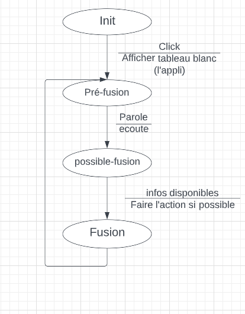

# Rapport IHM Multimodale

- Kahina Chalabi
- Rémi Laborie

[https://github.com/reminator329/TP_IHM_Multimodale](https://github.com/reminator329/TP_IHM_Multimodale)
---

# Introduction

Le but de ce projet est de spécifier, concevoir et implémenter un moteur de fusion multimodale pour interagir avec une application, avec la parole et le pointage (en utilisant la souris) afin de créer, déplacer ou supprimer des formes.

# Utilisation de l’application

Nous avons choisi trois action possibles qui sont : créer, déplacer et supprimer 
quatre formes possibles : losange, triangle, rectangle et cercle
et trois couleurs : rouge, vert et bleu sinon gris par défaut.

# Chronogrammes

Parmi les chronogrammes que nous avons fait, certain ne sont pas pris en compte dans notre application : les cas 1, 3, 4, 6, 7 et 9. Car nous ne faisons pas d’action monomodale ; nous n’avons pas implémenté le fait de pouvoir créer une forme sans donner de localisation ; nous n’avons pas implémenté le choix de la couleur par clic ; nous n’avons pas pris en compte dans la grammaire le cas qui ne se dit pas. Pour le cas 9, l’action fonctionne mais ne prend pas en compte la forme ni la couleur dite par l’utilisateur, l’application déplacera une des formes se trouvant sous le clic.

Pour les cas 8 à 10, “forme” peut être le nom de la forme ou bien les formulations “cette forme” ou “ça” (correspondant au “where” de la grammaire).

Sur les chronogramme, on peut voir des crochets au niveau des clics correspondant au temps de capture d’un clic. Cependant, notre application de fonctionne pas comme cela. En réalité, les clics sont capturés indépendamment de la voix. Une fois que la voix est capturée, l’application regarde si l’utilisateur à fait suffisamment de clics depuis la dernière commande ou attend d’en recevoir avant la prochaine commande et exécutera l’action une fois toutes les informations récoltées.

# Diagramme de classes

Dans ce diagramme, nous pouvons voir la gestion des classes dans le code. La classe Main exécutant le code principal utilise une machine à état FSM expliquée dans la partie dédiée.
La classe Data permet de stocker toutes les informations nécessaires à la fusion des informations fournies par l’utilisateur pour exécuter l’action demandée.

# Machine à états

[https://lucid.app/lucidchart/316edef3-3426-4be1-b995-39c686fb520c/edit?beaconFlowId=D26E0A5DA75A602E&invitationId=inv_03a43988-23b1-4d41-b553-470e13521367&page=0_0#](https://lucid.app/lucidchart/316edef3-3426-4be1-b995-39c686fb520c/edit?beaconFlowId=D26E0A5DA75A602E&invitationId=inv_03a43988-23b1-4d41-b553-470e13521367&page=0_0#) à modifier si besoin

Nous avons 4 états possible; init c’est l’état d’initialisation (affichage de l’application) en cliquant nous aurons accès à un tableau blanc afin de faire les actions possibles qui nous mène à l’état pré-fusion le moteur écoute ce qu’on lui dit de faire, s’il arrive à reconnaitre l’action (la commande) il passe à l’état possible-fusion tout en continuant à écouter pour recevoir le reste des informations importantes (forme, couleur..ect).

Si tout s’est bien passé (action réalisée) nous retournons à l’état de pré-fusion.

Nous n’avons pas eu le temps de gérer le cas où le moteur ne reçoit pas toutes les informations, dans ce cas l’application reste en attente.

# Exemples d’utilisation

Écran d’accueil de l’application

Résultat après avoir dit “Créer un triangle rouge ici” et un clic

Résultat après avoir dit “Déplace ce triangle rouge ici” et deux clic : un sur le triangle et un sur la destination

Résultat après avoir dit “Supprime ce triangle” et un clic sur le triangle

# Exemple vidéo

[https://www.youtube.com/watch?v=7Gak6B1yGxM](https://www.youtube.com/watch?v=7Gak6B1yGxM)